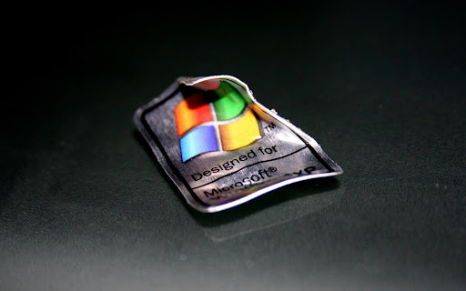

RebornXP
===

RebornXP is an effort to bring back the late 2000's personal computing experience right to your desktop, but in a moden way.
  
 

# New Features
- App Store
- New themes
- User Accounts
- Browser Storage
- Upload Local files from host OS to RebornXP (Copy from host OS and Paste to RebornXP folder)
- Download RebornXP files to host OS
# Planned Features
- Add a Database System (No need to store data in browser)
- Add more apps
- Redesign the Taskbar with more items such as network, sound e.t.c)

#  Contributing
You are free to open issues and send pull requests - I'll happily merge them. If you are a developer & want to publish your web app to the App Store, [click here](https://github.com/shoaib-jamal/app-guide)

# Disclaimer
The Windows XP name, artwork, trademark are surely property of Microsoft. This project is provided for educational purposes only. It is not affiliated with and has not been approved by Microsoft.
